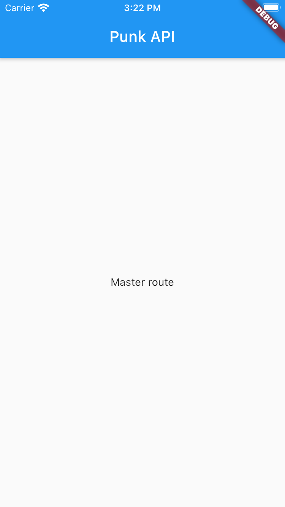

# 00- Initial

## Goal

The main purpose of this step is to create the project, understand how it is organized and prepare for the next steps.

You are going to:

- create your first widget
- import widgets from one file to another
- use `Scaffold`, `AppBar`, `Center` and `Text` widgets

At the end of this step, you will have built this :point_down:

<figure style="text-align: center;">
    
</figure>

## Create the project

- create a new folder _punk_api_, open a terminal and move inside the created folder

- create the Flutter application

```shell
flutter create --org com.nartawak --project-name punk_api .
```

- open the project with your IDE (Android Studio, VsCode)

- start the emulator (Android or/and iOS)

- run the project, either with the IDE or in command line, and and check that the application is running correctly

```shell script
flutter run
```

## What a flutter project looks like ?

```
├── android             // 4
├── build               // 3
├── ios                 // 5
├── lib                 // 1
|   └── main.dart       // 2
├── pubspec.lock
├── pubspec.yaml        // 7
└── test                // 6
```

1. _lib:_ folder that contains all the Dart files.
2. _main.dart:_ default Dart entrypoint. Must define a `main` function which is the starting point of every Dart program.
3. _build:_ generated by flutter to cache build stuff files
4. _android:_ Android native application
5. _ios:_ iOS native application
6. _test:_ dart test files. By convention, test files have `_test` suffix
7. _pubspec.yml:_ manage pub package metadata and dependencices. Learn more about [pubspec.yml](https://dart.dev/tools/pub/pubspec)

::: tip
By default, Flutter application run the `lib/main.dart` as dart entrypoint, but you can change it with `-t` option.

```shell script
flutter run -t <CUSTOM>.dart
```

:::

## Create the master route

If you look at the `lib/main.dart` file, you can see it has many reponsabilities:

- the `main` function that runs the application
- the `MyApp` widget which is the root widget of the application
- the `HomePage widget`

- create folder and files like below

```
./lib
├── main.dart
├── app.dart
└── routes
    └── master_route.dart
```

- keep only the main function in the `lib/main.dart` file

- copy the `MyApp` widget in the `app.dart` file. Fix the imports in `main.dart` and `app.dart` files

- create a stateless widget `MasterRoute` in the `master_route.dart` file. Use this widget in home argument of `MaterialApp` widget in `app.dart` file

::: tip
With Android Studio, to create a stateless widget, start type `stless` and `Ctrl + espace` to use a live template that creates widget boilerplate.  
:::

```dart
class MasterRoute extends StatelessWidget {
  @override
  Widget build(BuildContext context) {
    return Container();
  }
}
```

```dart{7}
MaterialApp(
  title: 'Flutter Demo',
  theme: ThemeData(
    primarySwatch: Colors.blue,
    visualDensity: VisualDensity.adaptivePlatformDensity,
  ),
  home: MasterRoute(),
);
```

::: warning Widgets

> Flutter widgets are built using a modern framework that takes inspiration from React. The central idea is that you build your UI out of widgets. Widgets describe what their view should look like given their current configuration and state.

> A widget’s main job is to implement a build() function, which describes the widget in terms of other, lower-level widgets

There is 3 kinds of widgets:

- [Stateless Widget](https://api.flutter.dev/flutter/widgets/StatelessWidget-class.html), for widgets that always build the same way given a particular configuration and ambient state.
- [Statefull Widget](https://api.flutter.dev/flutter/widgets/StatefulWidget-class.html) and [State](https://api.flutter.dev/flutter/widgets/State-class.html), for widgets that can build differently several times over their lifetime.
- [InheritedWidget](https://api.flutter.dev/flutter/widgets/InheritedWidget-class.html), for widgets that introduce ambient state that can be read by descendant widgets.

Learn more about [widgets](https://flutter.dev/docs/development/ui/widgets-intro)
:::

::: danger Immutable

> Widgets are the central class hierarchy in the Flutter framework. A widget is an immutable description of part of a user interface. Widgets can be inflated into elements, which manage the underlying render tree.

:::

For now, you only need to use Stateless widget, we introduce Statefull widget later in the workshop.

- in the `build` function of the `MasterRoute`, return a `Scaffold` widget that declares:

  - appBar with title 'Punk API'
  - body that `Center` a `Text` 'Master route'

- in a terminal, run the `flutter test` that should fail. Update the test to find the 'Master route' text.
