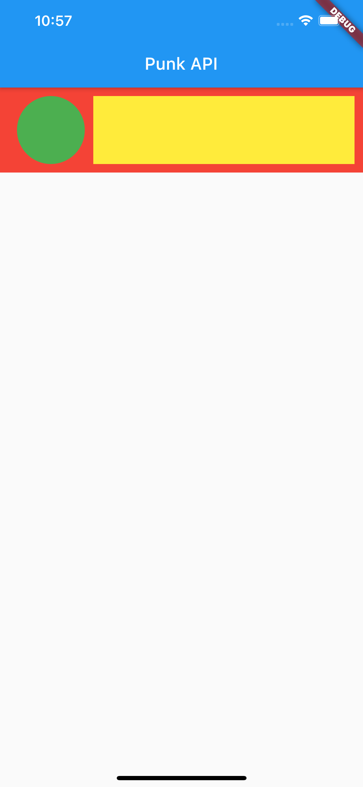

# 01- Layout

## Goal

The main goal of this step is to start manipulating layout widgets, refactoring code by creating a widget that can be used more than once.

You are going to:

- use `Container` widget, add color background, shape and decoration
- use `Row`, `Column` and `SingleChildScrollView` widgets
- create private function
- manipulate Dart `List` object and [spread operator](https://dart.dev/guides/language/language-tour#spread-operator)

At the end of this step, you will have built this :point_down:

<figure style="text-align: center;">
    
</figure>

## Playing with Container

- in `MasterRoute` widget, replace the `Center` and `Text` widgets with a `Container` widget

- configure it with color argument set to `Colors.red`

You should have the entire screen like this :point_down:

<figure style="text-align: center;">
    
</figure>

::: tip
By default, when a container does not have any child widget and no confiugration for width and height, it takes the size of the parent widget, in this case, the `Scaffold` widget.
:::

- now configure the container with a child container with this configuration:
  - color: green
  - width: 100
  - height: 100

You should have the entire screen like this :point_down:

<figure style="text-align: center;">
    
</figure>

::: tip Flutter Inspector
Open Flutter Inspector to verify the 2 containers are in the widgets tree. Play with `select mode` and `debug paint`. You can open the `DevTools` in web page too to have more tools !!!
:::

- add padding on the red container on all sides with 10 as value . You have 2 options to do this:
  - wrap the green container with `Padding` widget
  - configure red container with padding argument. This is a shortcut, in fact the `Padding` widget will be created by the `Container` widget

<figure style="text-align: center;">
    
</figure>

```dart
class MasterRoute extends StatelessWidget {
  @override
  Widget build(BuildContext context) {
    return Scaffold(
      appBar: AppBar(
        title: Text('Punk API'),
        centerTitle: true,
      ),
      body: Container(
        color: Colors.red,
        padding: const EdgeInsets.all(10),
        child: Container(
          color: Colors.green,
          height: 100,
          width: 100,
        ),
      ),
    );
  }
}
```

::: danger Flutter constraints
**Constraints go down. Sizes go up. Parent sets position**

[Learn more about Flutter constraints](https://flutter.dev/docs/development/ui/layout/constraints)
:::

## Row layout

After playing with the `Container` widget, it's now time to create the template of a line as mentioned in the purpose of this step

<figure style="text-align: center;">
    
</figure>

- delete what we just did

- create a Container:

  - color: red
  - height: 100
  - padding: `const EdgeInsets.all(10)`

- add a `Row` as child widget of the red container
- first container:

  - width: 100
  - color: green
  - decoration: `BoxDecoration(shape: BoxShape.circle)`

- second container
  - color: yellow
  - occupies the rest of the row's width (see `Expanded` widget)

## Extract stateless widget PunkApiCard

The row we just created will have to be duplicated to get the target list. So it's the right time to make a widget that we can use several times.

- put your cursor on the red container

- right click :point_right: `Refactor/Extract Flutter Widget` or `⌥⌘w` shortcut

- call the widget `PunkApiCard`. The widget should be created in the same file (master_route.dart)

- copy/ paste this widget in a dedicated dart file

```
  ./lib
  ├── main.dart
  ├── app.dart
  └── routes
      └── master
            └── widgets
                └── punkapi_card_route.dart
```

## Create a basic list of PunkApiCard

Now that we have the PunkApiCard widget, we will create a list of 10 items.

- Replace the `PunkApiCard` in the `MasterRoute` with a `Column`

- add 10 `PunkApiCard` as children of the `Column` widget

- you should have this error which is due to the fact that the Column exceeds the maximum vertical size. This type of error often occurs when developing with Flutter.
  Depending on what you want to do, there are widgets to handle the following cases.

<figure style="text-align: center;">
    
</figure>

```shell script
════════ Exception caught by rendering library ═════════════════════════════════════════════════════
The following assertion was thrown during layout:
A RenderFlex overflowed by 277 pixels on the bottom.

The overflowing RenderFlex has an orientation of Axis.vertical.
The edge of the RenderFlex that is overflowing has been marked in the rendering with a yellow and black striped pattern. This is usually caused by the contents being too big for the RenderFlex.

Consider applying a flex factor (e.g. using an Expanded widget) to force the children of the RenderFlex to fit within the available space instead of being sized to their natural size.
This is considered an error condition because it indicates that there is content that cannot be seen. If the content is legitimately bigger than the available space, consider clipping it with a ClipRect widget before putting it in the flex, or using a scrollable container rather than a Flex, like a ListView.

The specific RenderFlex in question is: RenderFlex#16cd6 relayoutBoundary=up1 OVERFLOWING
...  parentData: offset=Offset(0.0, 103.0); id=_ScaffoldSlot.body (can use size)
...  constraints: BoxConstraints(0.0<=w<=428.0, 0.0<=h<=823.0)
...  size: Size(428.0, 823.0)
...  direction: vertical
...  mainAxisAlignment: start
...  mainAxisSize: max
...  crossAxisAlignment: center
...  verticalDirection: down
◢◤◢◤◢◤◢◤◢◤◢◤◢◤◢◤◢◤◢◤◢◤◢◤◢◤◢◤◢◤◢◤◢◤◢◤◢◤◢◤◢◤◢◤◢◤◢◤◢◤◢◤◢◤◢◤◢◤◢◤◢◤◢◤◢◤◢◤◢◤◢◤◢◤◢◤◢◤◢◤◢◤◢◤◢◤◢◤◢◤◢◤◢◤◢◤◢◤◢◤
════════════════════════════════════════════════════════════════════════════════════════════════════

```

::: tip
When we want to have scrollable lists, the most suitable widget is `ListView` which we will use later in this workshop.
:::

- for now, you can wrap the `Column` widget with `SingleChildScrollView`, it should fix the the error and make the column scrollable

Duplicating the same component 10 times is a bit rotten !!! we will therefore create a function that creates a list of 10 items with the value null.

- create a private function in the `MasterRoute` object

```dart
  List _mockList() {
    return List.filled(10, null);
  }
```

- use this function with `map` operator and `spread operator` to create the column's children

```dart
..._mockList()
    .map(
      (e) => Container(
        margin: EdgeInsets.only(bottom: 10),
        child: PunkApiCard(),
      ),
    )
    .toList()
```
