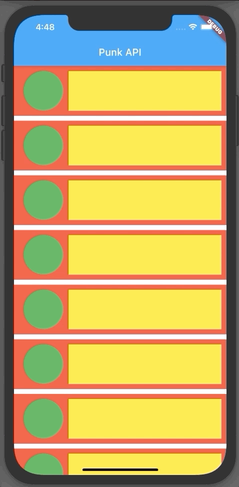

# 02- Network

## Goal

The main goal of this step is to start manipulating layout widgets, refactoring code by creating a widget that can be used more than once.

You are going to:

- use `Container` widget, add color background, shape and decoration
- use `Row`, `Column` and `SingleChildScrollView` widgets
- create private function
- manipulate Dart `List` object and [spread operator](https://dart.dev/guides/language/language-tour#spread-operator)

At the end of this step, you will have built this :point_down:

<figure style="text-align: center;">
    
</figure>

## Todo
