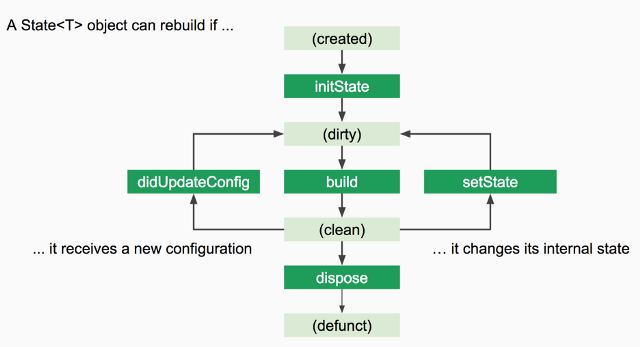

# 02- Network

## Goal

The main goal of this step is to start manipulating layout widgets, refactoring code by creating a widget that can be used more than once.

You are going to:

- use `http` package to make API call
- decode Json data
- use `StatefulWidget` and lifecycle hooks
- use `FutureBuilder` to display UI base on `Future`
- use `ListView` widget

At the end of this step, you will have built this :point_down:

<figure style="text-align: center;">
    
</figure>

## HTTP package

First you need to add third party dependency to make HTTP calls. Adding a dependency can be done via pubspec.yml at the root of the project.

- add `http` package

```yaml
dependencies:
  flutter:
    sdk: flutter
  cupertino_icons: ^1.0.0

  http: ^0.12.2
```

::: warning
In the YAML format, the indentation is important, if you don't respect it you will have errors.
:::

- fetch third party package, either via yout IDE or in command line

```shell script
flutter pub get
```

::: tip Package registry

[pub.dev](https://pub.dev/) is the official dart packages registry, you can find a lot of useful packages. Each package
defines example, installing documentation and more...

example: [http](https://pub.dev/packages/http/example)

:::

## Beer model

For this workshop we will use the public [Punk API](https://punkapi.com/documentation/v2) to retrieve data.

example of URL we are going to use: `https://api.punkapi.com/v2/beers?page=1&per_page=10`. Each object have a lot of properties, we only need the following properties:

```json
{
  "id": 1,
  "name": "Buzz",
  "tagline": "A Real Bitter Experience.",
  "description": "A light, crisp and bitter IPA brewed with English and American hops. A small batch brewed only once.",
  "image_url": "https://images.punkapi.com/v2/keg.png"
}
```

- create a `models` folder and a `beer.dart` file inside

```shell script
./lib
├── app.dart
├── models
│└── beer.dart
└── routes
    └── master
        ├── master_route.dart
        └── widgets

```

- create a class `Beer`
  - use named parameters
  - `id` `name` and `imageUrl` are required and cannot be null
  - add named constructor `fromJson`
  - decorate this class as immutable

```dart
factory Beer.fromJson(Map<String, dynamic> json) {
    return Beer(
      id: json['id'] as int,
      name: json['name'] as String,
      tagline: json['tagline'] as String,
      description: json['description'] as String,
      imageURL: json['image_url'] as String,
    );
  }
```

## BeerRepository

- create a `repositories` folder and a `beer_repository.dart` file inside

```shell script
./lib
├── app.dart
├── models
│└── beer.dart
├── repositories
│└── beer_repository.dart
└── routes
    └── master
        ├── master_route.dart
        └── widgets

```

- create a class `BeersRepository`
  - this object should define a `http.Client` class property initialize when creating this object
  - `http.Client` class property is required and cannot be null
  - decorate this class as immutable
- expose a function `getBeers`

```dart
  Future<List<Beer>> getBeers() async {
    // TODO: make API call and decode json in List<Beer>
    return null;
  }
```

::: tip
Use [documentation](https://flutter.dev/docs/cookbook/networking/background-parsing) to manage API call
:::

## StatefulWidget

> Stateful widgets maintain state that might change during the lifetime of the widget. Implementing a stateful widget requires at least two classes: a StatefulWidget that creates an instance of a State class. The StatefulWidget object is, itself, immutable and can be thrown away and regenerated, but the State object persists over the lifetime of the widget.

<figure style="text-align: center;">
    
</figure>

## Approaches for fetching asynchronous data

It is possible to use 2 different approaches to retrieve external and asynchronous data to a widget.

### use StatefulWidget

I do the parallel with frameworks often known in web development, component oriented, such as React, Vue or Angular.
When a component is initialized, an HTTP call is triggered, and during the asynchronous return, the state of the component is updated to display the data received.

It is possible to do exactly the same approach with Flutter. **Only the `StatefulWidget` allows using `State` and lifecycle hooks.**

### use FutureBuilder or StreamBuilder

Flutter offers 2 'builders' widgets that allow you to build a tree of widgets based on asynchronous data.

- FutureBuilder takes a Future as an input
- StreamBuilder takes a Stream as input

**The primary advantage of these widgets is that they often allow you to create StatelessWidget instead of StatefulWidget. The code is often less verbose and more easily testable.**

:::tip
Copy the `MasterRoute` in the same file. Name the first `MasterRouteStateful` and the second `MasterRouteFutureBuilder`.
This will allow us to keep and compare the 2 solutions we are going to implement
:::

## MasterRouteStateful

- add `BeersRepository` as final property of `MasterRouteStateful`

- create a constructor, `beersRepository` is required and cannot be null

- convert `MasterRouteStateful` in `StatefulWidget`

- add 3 properties in State

  - \_beers: list of `Beer`
  - \_isError: boolean, default value to false
  - \_isLoading: boolean, default value to true

- override `initState` and call `getBeers` in these hook.

::: tip
It is often good practice to create a private function rather than do all the processing in the `initState`.
It also allows to create an `async` function and to be able to use the keyword `await`

```dart
  @override
  void initState() {
    super.initState();
    _fetchBeers();
  }
```

:::

- Manage the state via `setState` function in `_fetchBeers` function

```dart
// Fetch data success
setState(() {
    _isError = false;
    _isLoading = false;
    _beers = beers;
});

// Fetch data error
setState(() {
  _isError = true;
  _isLoading = false;
  _beers = null;
});
```

- create a `_displayBody` that displays body according to state:
  - if error display a centered text 'An error occurred'
  - if loading display a centered `CircularProgressIndicator`
  - use \_beers instead of `_mockList` to create the column's children

```dart
  @override
  Widget build(BuildContext context) {
    return Scaffold(
      appBar: AppBar(
        title: Text('Punk API'),
        centerTitle: true,
      ),
      body: _displayBody(),
    );
  }
```

- open `PunkApiCard` widget

- add Beer as final property, initialize it by constructor, it is required and cannot be null

- remove red color to the red container and add decoration

```dart
Container(
  height: 100,
  padding: const EdgeInsets.all(10),
  decoration: const BoxDecoration(
    color: Colors.white,
    boxShadow: [
      BoxShadow(
        color: Colors.grey,
        offset: const Offset(0.0, 1.0),
        blurRadius: 6.0,
      ),
    ],
  ),
);
```

- add an `Image.network` with `beer.imageURL` as child to the green container et remove the decoration configuration.

- replace the yellow container with a column with 2 `Text`

  - beer.name
  - beer.tagline

- adjust padding and alignment on the column

## MasterRouteFutureBuilder

- - add `BeersRepository` as final property of `MasterRouteFutureBuilder`

- create a constructor, `beersRepository` is required and cannot be null

- replace the body configuration of `Scaffold` with `FutureBuilder`

```dart
  @override
  Widget build(BuildContext context) {
    return Scaffold(
      appBar: AppBar(
        title: Text('Punk API'),
        centerTitle: true,
      ),
      body: FutureBuilder(
        future: beersRepository.getBeers(),
        builder: (_, snapshot) {
          if (snapshot.hasError) {
            // TODO: manage error
          }

          if (!snapshot.hasData) {
            // TODO: manage loading
          }

          // TODO: manage list
          return null;
        },
      ),
    );
  }
```

- Replace the Todo, to have the same behavior as with `MasterRouteStateful`

## ListView

Like mentionned in previous step, `Column` and `SingleChildScrollView` are not designed to display long list, we are going to use ListView which is made for.

- replace `SingleChildScrollView` with `ListView`

```dart
  ListView.builder(
    itemCount: beers.length,
    itemBuilder: (_, index) {
      return Container(
        margin: EdgeInsets.only(bottom: 10),
        child: PunkApiCard(beer: beers[index]),
      );
    },
  );
```

::: warning ListView

ListView have a constructor with children configuration (`ListView(children: [],)`), prefer ListView.builder named constructor for big list.

See documention:

> This constructor is appropriate for list views with a large (or infinite) number of children because the builder is called only for those children that are actually visible.

:::

- in `BeersRepository` update the URL to get 80 items in page `https://api.punkapi.com/v2/beers?page=1&per_page=80`
