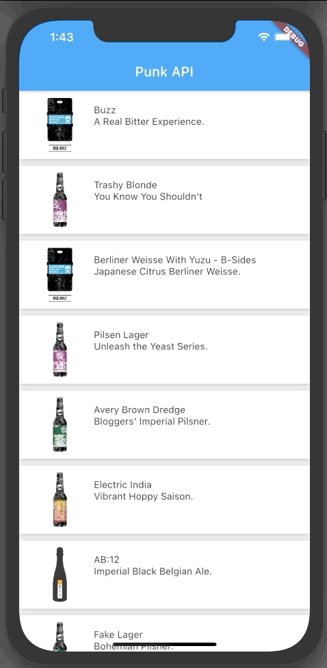

# 04- Theme / Assets

## Goal

The main goal of this step is to start manipulating layout widgets, refactoring code by creating a widget that can be used more than once.

You are going to:

- TODO

At the end of this step, you will have built this :point_down:

<figure style="text-align: center;">
    
</figure>

## Assets

## Theme
