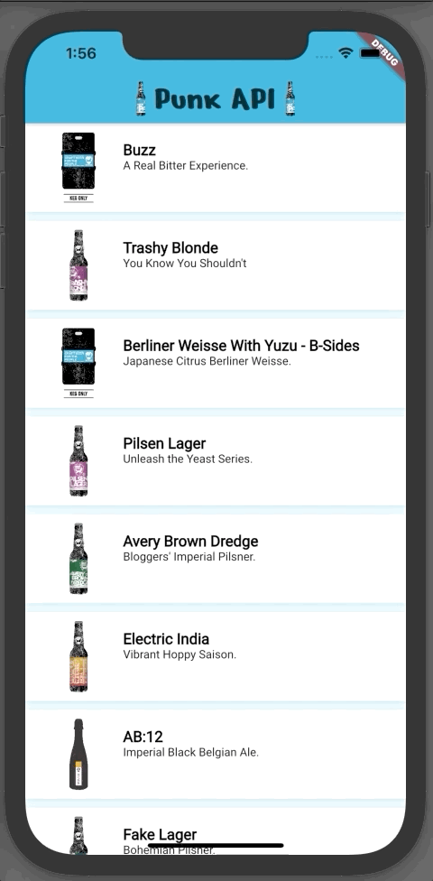

# 04- Theme / Assets

## Goal

The main goal of this step is to start manipulating embedded assets (images, fonts), and themes (light and dark) used by material widgets

You are going to:

- use `TextStyle` with embedded font
- use `Image` with embedded asset
- use `ThemeData` to create light and dark theme
- use `ThemeMode` to switch between light and dark mode

At the end of this step, you will have built this :point_down:

<figure style="text-align: center;">
    
</figure>

## Embedded assets

During the development of a front-end application, some assets are retrieved dynamically via Http calls for example, but we also need to have static assets (image, font, json, ...).
Static assets are important in terms of performance, no need to wait for the return of one or more network calls to be able to display a widget.

:::warning
The more static assets you have, more the size of the application will grow. You must therefore be careful on this point.
:::

### Images

For now, we have displayed images from the Rest API with the widget `Image.network('url')`. Now, we are going to use
`Image.asset` to display embedded image.

- download this image
  <a download="punkapi.png" href="/04_theme_assets_download/images/punkapi.png" title="punkapi">
  punkapi.png
  </a>

- create a `assets/images` directory and add this image inside

```
├── README.md
├── android
├── assets
|    └── images
|        └── punkapi.png
├── build
├── coverage
├── ios
├── lib
├── pubspec.lock
├── pubspec.yaml
├── punk_api.iml
└── test
```

- specifying asset in the `pubspec.yaml`.

::: tip
Adding an asset in the project file structure is not enough to embed an asset in the Android or iOS application. As mentioned
in the [documentation](https://flutter.dev/docs/development/ui/assets-and-images#specifying-assets), you need to declare it in the `pubspec.yaml`.
:::

:::warning
When adding assets, you need to re-run the Flutter application with command line or your IDE.
Hot restart or hot reload does not re-trigger a native build of the application. Assets will not be embedded in the application.
:::

```yaml
# ...
flutter:
  uses-material-design: true
  assets:
    # I often choose to add all assets in dedicated directory,
    # this avoids having to maintain an exhaustive list.
    - assets/images/
# ...
```

In the previous step, we use 2 widgets in the `master_route.dart` file:

- `MasterRouteStateful`
- `MasterRouteFutureBuilder`

We only keep the `MasterRouteFutureBuilder`, so you can delete `MasterRouteStateful` and rename `MasterRouteFutureBuilder` to `MasterRoute` and clean the tests

- In the `MasterRoute` widget, update the title of `AppBar` by replacing `Text` widget with a `Row`. Add as children of the `Row`, the following widgets in order:
  - image punkapi.png
  - title
  - image punkapi.png

```dart

final image = Image.asset(
  'assets/images/punkapi.png',
  height: 40,
  width: 30,
  fit: BoxFit.fitHeight,
);
```

- add a new test in the `master_route_test.dart` where you can use the golden testing to validate the `AppBar`

::: tip Golden testing
When you create a test with golden testing, you need to run the `flutter test` command with the `--update-golden` option to generate the png file.
Each time you modify the widget that you test with golden test, you need to re-run the command with this option to generate a new png.

[Learn more](https://medium.com/flutter-community/flutter-golden-tests-compare-widgets-with-snapshots-27f83f266cea)
:::

::: warning Macos users
If you are a macos user, you need to disable `Use font smoothing when available` in **System preference / General**

[Fond more in this issue](https://github.com/flutter/flutter/issues/56383)
:::

```dart
testWidgets('should golden test the AppBar', (WidgetTester tester) async {
  await tester.pumpWidget(
    MaterialApp(
      home: MasterRoute(
        beersRepository: beersRepository,
      ),
    ),
  );

  final appBarFinder = find.byType(AppBar);
  expect(appBarFinder, findsOneWidget);

  await expectLater(appBarFinder, matchesGoldenFile('app_bar.png'));
});
```

### Fonts

- download this 2 fonts
  <a download="NerkoOne-Regular.ttf" href="/04_theme_assets_download/fonts/NerkoOne-Regular.ttf" title="NerkoOne-Regular">
  NerkoOne-Regular
  </a>,
  <a download="Roboto-Regular.ttf" href="/04_theme_assets_download/fonts/Roboto-Regular.ttf" title="Roboto-Regular">
  Roboto-Regular
  </a>

- create a `assets/fonts` directory and add these fonts inside

```
├── README.md
├── android
├── assets
|   ├── fonts
|   |   ├── NerkoOne-Regular.ttf
|   |   └── Roboto-Regular.ttf
|   └── images
|       └── punkapi.png
├── build
├── coverage
├── ios
├── lib
├── pubspec.lock
├── pubspec.yaml
├── punk_api.iml
└── test
```

- specifying fonts in the `pubspec.yaml`

::: tip
Like assets, [fonts have to be specifying](https://flutter.dev/docs/cookbook/design/fonts#2-declare-the-font-in-the-pubspec) in pubspec.yaml file.

You can also use the `google_fonts` [package](https://pub.dev/packages/google_fonts) to use front from [fonts.google.com](https://fonts.google.com/) in your project.
:::

```yaml
flutter:
  uses-material-design: true
  fonts:
    - family: Roboto
      fonts:
        - asset: assets/fonts/Roboto-Regular.ttf
    - family: Nerko_One
      fonts:
        - asset: assets/fonts/NerkoOne-Regular.ttf
```

- use `Nerko_one` font familly like below in the title `Text` widget in the `AppBar`

```dart
Text(
  'Punk API',
  style: const TextStyle(
    fontFamily: 'Nerko_One',
    fontSize: 40,
  ),
);
```

- update the golden test, we previously created, it should be failed!!

- open `punkapi_card.dart` file

- use `Roboto` both for the name and the tagline
  - name must have 17 as fontSize and must be bold
  - tagline must have 13 as fontSize

```dart
// you can create a TextStyle that mutualize common configuration
const labelStyle = const TextStyle(
  fontFamily: 'Roboto',
);
```

```dart
final name = Text(
    beer.name,
    // use the common TextStyle by creating a new instance and define only specific values
    style: labelStyle.copyWith(
      fontSize: 17,
      fontWeight: FontWeight.bold,
    ),
);
```

```dart
final tagline = Text(
    beer.name,
    style: labelStyle.copyWith(
      fontSize: 13,
    ),
);
```

- create `should golden test the PunkApiCard` in the `punkapi_card_test.dart` file
  - generate the png file
  - delete the `should display image` test, golden test cover this use case

## Theme

> To share colors and font styles throughout an app, use themes. You can either define app-wide themes, or use Theme widgets that define the colors and font styles for a particular part of the application. In fact, app-wide themes are just Theme widgets created at the root of an app by the MaterialApp.
>
> After defining a Theme, use it within your own widgets. Flutter’s Material widgets also use your Theme to set the background colors and font styles for AppBars, Buttons, Checkboxes, and more.
> [Learn more](https://flutter.dev/docs/cookbook/design/themes)

If we do as before, each widget will have to define its own widgets to apply the design, text style, define the primary colour, .....
In these cases, as a developer, our good practice is often to create a file that mutualizes the common elements
(creation of a constant file for example).

We can of course do this, however Flutter also offers a theme system on which a number of widgets provided by the framework are based.

- open the `app.dart` file. As you can see, a `theme` is already defined in the `MaterialApp` widget which is an implementation of [ThemeData](https://api.flutter.dev/flutter/material/ThemeData-class.html).
  `ThemeData` comes with default value, you don't need to define all the configuration.

```dart
class PunkApiApp extends StatelessWidget {
  @override
  Widget build(BuildContext context) {
    return MaterialApp(
      title: 'Flutter Demo',
      theme: ThemeData(
        primarySwatch: Colors.blue,
        visualDensity: VisualDensity.adaptivePlatformDensity,
      ),
      home: MasterRouteFutureBuilder(
        beersRepository: BeersRepository(
          client: http.Client(),
        ),
      ),
    );
  }
}
```

::: warning
As mentioned above, the theme is defined by the `MaterialApp` widget which is the root widget for the use of widgets that
implements the [Material](https://material.io/) design system powered by Google. Material is the recommended design system,
standard for the Android platform, but the specification is made for all platforms.

[Discover all Material widgets that implements Material guideline in Flutter](https://flutter.dev/docs/development/ui/widgets/material)

What does this mean in a Flutter application?

The application as we wrote it is deployed in the same way whatever the platform (ios, Android, web, ...). If you wish to
have a design system on iOS that respects the platform guidelines (Cupertino), you will be obliged to use the `CupertinoApp`
implementation also provided by Flutter.

[Discover all Cupertino widgets that implements Cupertino guideline in Flutter](https://flutter.dev/docs/development/ui/widgets/cupertino)

If you need to condition the display according to the platform, you will have to do conditional rendering using the [Platform](https://api.flutter.dev/flutter/package-platform_platform/Platform-class.html) object provided by Flutter.
This increases the complexity of your application but allows you to respect the guidelines of each of the platforms to which users are accustomed.

I will probably address this subject in a dedicated workshop, but for the rest of this workshop we will only use Material design.
:::

### Light theme

- create a file `punkapi_theme.dart` near to the `app.dart`

```dart
// By convention in Flutter, constant name is declared in CamelCase with k as prefix
// You can find constants in Flutter SDK easily, i'm used to doing the same thing.
const kLightPrimaryColor = Color(0xFF00AFDA);

const kRobotoTextStyle = TextStyle(
  fontFamily: 'Roboto',
);

final lightTextStyle = kRobotoTextStyle.copyWith(
  color: Colors.black,
);

final lightTheme = ThemeData(
  primaryColor: kLightPrimaryColor,
  shadowColor: kLightPrimaryColor,
  backgroundColor: Colors.white,
  visualDensity: VisualDensity.adaptivePlatformDensity,
  textTheme: TextTheme(
    headline6: lightTextStyle.copyWith(
      fontSize: 17,
      fontWeight: FontWeight.bold,
    ),
    subtitle1: lightTextStyle.copyWith(
      fontSize: 13,
    ),
  ),
);
```

- update the `PunkApiApp`

```dart
class PunkApiApp extends StatelessWidget {
  @override
  Widget build(BuildContext context) {
    return MaterialApp(
      title: 'Flutter Demo',
      theme: lightTheme,
      home: MasterRoute(
        beersRepository: BeersRepository(
          client: http.Client(),
        ),
      ),
    );
  }
}
```

**How to retrieve theme values in widget?**

```dart
class PunkApiCard extends StatelessWidget {

  @override
  Widget build(BuildContext context) {
    // Get a ThemeData from InheritedWidget
    final theme = Theme.of(context);

    return Container();
  }
}

```

:::tip InheritedWidget

> Base class for widgets that efficiently propagate information down the tree.
> Inherited widgets, when referenced in this way, will cause the consumer to rebuild when the inherited widget itself changes state.
> [Learn more](https://api.flutter.dev/flutter/widgets/InheritedWidget-class.html)

In other words, a widget that inherits from `InheritedWidget` is a widget that has a status and/or callbacks to update the status.
It allows descendant widgets (under tree) to access its state and/or callbacks.
A descendant widget that retrieves data from an `InheritedWidget` is called a consumer. Each `InheritedWidget` should override
the `updateShouldNotify` method that notify if consumers must be rebuilt if the state changes.

Technically this allows a top-down widget to retrieve values without being passed from widget to widget throughout the tree.

The drawback is that the coupling of a widget (consumer) to an `InheritedWidget` is not defined in its constructor, if the `InheritedWidget`
is not present in the ascending widgets, there will be no compilation error, but an error at runtime.

For example, `MaterialApp` widget create 2 useful InheritedWidget:

- [Theme](https://api.flutter.dev/flutter/material/Theme-class.html): retrieve theme values
- [MediaQuery](https://api.flutter.dev/flutter/widgets/MediaQuery-class.html): retrieve a current device media values
  :::

- use `Theme` in `PunkApiCard` widget

  - `theme.cardColor` for color property in `BoxDecoration`
  - `theme.shadowColor.withOpacity(0.4)` for color property in `BoxShadow`
  - `theme.textTheme.headline6` for style property in `Text` (name)
  - `theme.textTheme.subtitle1` for style property in `Text` (tagline)

- update test for the `PunkApiCard` widget with the theme

### Light and dark mode

Platforms increasingly support light and dark themes. It is possible to configure it on each platform via the settings.

The benefits of a dark theme:

> - Can reduce power usage by a significant amount (depending on the device’s screen technology).
> - Improves visibility for users with low vision and those who are sensitive to bright light.
> - Makes it easier for anyone to use a device in a low-light environment.

- [> iOS 13](https://developer.apple.com/design/human-interface-guidelines/ios/visual-design/dark-mode)
  - [Enable dark mode iOS device](https://developer.apple.com/design/human-interface-guidelines/ios/visual-design/dark-mode)
  - [Enable dark mode iOS simulator](https://www.youtube.com/watch?v=t7Q4iMYfigs)
- [> Android API 29](https://developer.android.com/guide/topics/ui/look-and-feel/darktheme)

`MaterialApp` allow us to define light and dark theme and strategy we need to switch from one to the other via `themeMode` ([ThemeMode](https://api.flutter.dev/flutter/material/MaterialApp/themeMode.html)) configuration.

```dart
class PunkApiApp extends StatelessWidget {
  @override
  Widget build(BuildContext context) {
    return MaterialApp(
      title: 'Flutter Demo',
      theme: lightTheme,
      darkTheme: darkTheme,
      // ThemeMode.system is the default value, theme is based on OS theme configuration
      themeMode: ThemeMode.system,
      home: MasterRoute(
        beersRepository: BeersRepository(
          client: http.Client(),
        ),
      ),
    );
  }
}
```

### Dark theme

- add dark theme in the `punkapi_theme.dart` file

```dart

final darkTextStyle = kRobotoTextStyle.copyWith(
  color: Colors.white,
);

final darkTheme = ThemeData(
  primaryColor: Colors.black,
  backgroundColor: Colors.black87,
  shadowColor: Colors.white,
  cardColor: kLightPrimaryColor.withOpacity(0.5),
  visualDensity: VisualDensity.adaptivePlatformDensity,
  textTheme: TextTheme(
    headline6: darkTextStyle.copyWith(
      fontSize: 17,
      fontWeight: FontWeight.bold,
    ),
    subtitle1: darkTextStyle.copyWith(
      fontSize: 13,
    ),
  ),
);
```

- update `MaterialApp` configuration with darkTheme.

:::tip
To test theme changed based on the OS configuration you have to change the OS configuration theme setting.

With ios simulator, **Features/Toggle Appearance**
:::

- add test for the `PunkApiCard` widget that golden test the dark theme
