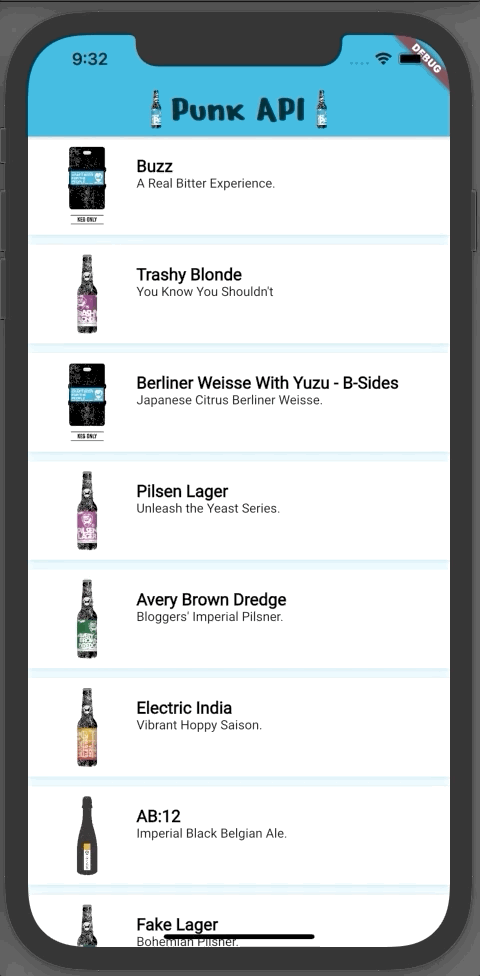

# 05- Navigation

## Goal

The main goal of this step is to start using Navigation API v1.0 to navigate between routes

You are going to:

- use `GestureDetector` to handle user gesture
- use `Function` to communicate between a child and a parent widget
- create typedef and use it
- use `Navigation` API 1.0 with anonymous and named routes

At the end of this step, you will have built this :point_down:

<figure style="text-align: center;">
    
</figure>

## GestureDetector

The most basic widget to handle a touch by user on the screen is the [GestureDetector](https://api.flutter.dev/flutter/widgets/GestureDetector-class.html)

- in the `PunkApiCard`, add the `GestureDetector` for it to wrap the Container

- define the `onTap` handler and print something to validate the handler is working

- add a new parameter `onBeerSelected` in the constructor of `PunkApiCard`
  - onBeerSelected is a function that take a Beer as argument
  - onBeerSelected returns nothing (void)

```dart
final void Function(Beer value) onBeerSelected;
```

:::tip typedef
I recommand you to use [typedef](https://dart.dev/guides/language/language-tour#typedefs)

> In Dart, functions are objects, just like strings and numbers are objects. A typedef, or function-type alias, gives a function type a name that you can use when declaring fields and return types

```dart
// create a typedef
typedef SelectedBeer = void Function(Beer beer);

// use a typedef
final SelectedBeer onBeerSelected;
```

:::

- in the `onTap` handler call, the `onBeerSelected` function if it's defined

- add a test that validate the handler is well called and returns the beer object

```dart
testWidgets('should call onBeerSelected when tapped',
        (WidgetTester tester) async {
      mockNetworkImagesFor(() async {
        Beer selectedBeerResult;

        await tester.pumpWidget(
          getMaterialAppLightThemeWrapper(
            child: PunkApiCard(
              key: cardKey,
              beer: mockBeer,
              onBeerSelected: (selectedBeer) {
                selectedBeerResult = selectedBeer;
              },
            ),
          ),
        );

        expect(selectedBeerResult, isNull);

        await tester.tap(find.byKey(PunkApiCard.gestureDetectorKey));
        await tester.pumpAndSettle();

        expect(selectedBeerResult, isNotNull);
      });
    });
```

- in the `MasterRoute`, declare the function and print the selectedBeer

```dart
PunkApiCard(
  beer: beers[index],
  onBeerSelected: (selectedBeer) {
    print(selectedBeer);
  },
)
```

## Navigation APIs

From [Flutter documentation](https://flutter.dev/docs/development/ui/navigation):

> To learn about Flutter’s original (1.0) navigation and routing mechanism, see the Navigation recipes in the Flutter cookbook and the Navigator API docs. The original navigation model uses an imperative approach.
>
> To learn about Flutter’s updated (2.0) navigation and routing mechanism, which uses a declarative approach, see Learning Flutter’s new navigation and routing system.
>
> Note that this new mechanism isn’t a breaking change—you can continue to use the original approach if that serves you well. If you want to implement deep linking, or take advantage of multiple navigators, check out the 2.0 version.

Even if in production today, I will use the new APIs for navigation, it is essential for me to be familiar with version 1.
**In this introductory Flutter workshop, I will use the 1.0 API.**

## Anonymous route

- create a `DetailRoute` widget
  - take a beer as argument
  - display the beer's name in the title

```dart
class DetailRoute extends StatelessWidget {
  final Beer beer;

  DetailRoute({
    Key key,
    this.beer,
  })  : assert(beer != null),
        super(key: key);

  @override
  Widget build(BuildContext context) {
    return Scaffold(
      appBar: AppBar(
        centerTitle: true,
        title: Text(beer.name),
      ),
      body: Center(
        child: Text('Detail route'),
      ),
    );
  }
}
```

- in the `MasterRoute`, navigate to the `DetailPage` using `Navigator.push`

```dart
PunkApiCard(
  beer: beers[index],
  onBeerSelected: (selectedBeer) {
    Navigator.push(
      context,
      MaterialPageRoute(
        builder: (_) => DetailRoute(
          beer: selectedBeer,
        ),
      ),
    );
  },
)
```

:::warning
One of the advantages of creating anonymous routes is that you can build the destination page (widget) by passing the arguments directly into the constructor.

One of the disadvantages is that if navigation to this page is declared in several places in your application, it will probably be more complicated to maintain.
:::

## Named routes

To answer the above problem, it is possible to declare a list of named routes.

- declare the route object, and the initial route

```dart
class PunkApiApp extends StatelessWidget {
  @override
  Widget build(BuildContext context) {
    return MaterialApp(
      title: 'Flutter Demo',
      initialRoute: MasterRoute.routeName,
      routes: {
        MasterRoute.routeName: (_) => MasterRoute(
              beersRepository: BeersRepository(
                client: http.Client(),
              ),
            ),
        DetailRoute.routeName: (_) => DetailRoute(),
      },
    );
  }
}
```

By declaring named routes, we can no longer pass arguments to the constructor, but we will be able to send arguments when we start navigation.

- use the `ModalRoute` object to get sending arguments

```dart
class DetailRoute extends StatelessWidget {
  static const routeName = '/detail';

  @override
  Widget build(BuildContext context) {
    final Beer beer = ModalRoute.of(context).settings.arguments;

    return Scaffold(
      appBar: AppBar(
        centerTitle: true,
        title: Text(beer.name),
      ),
      body: Center(
        child: Text('Detail route'),
      ),
    );
  }
}
```

- in the `MasterRoute`, navigate to the `DetailPage` using `Navigator.pushNamed`

```dart
Navigator.pushNamed(context, '/detail', arguments: selectedBeer);
```

## What about testing navigation ?

Testing navigation with the Test Widget is complicated in my opinion. But testing widgets that depend on the `ModalRoute` object is also complicated.

I advise you to use a state management which will allow you to have more flexibility in the tests, for the unit part.
For the functional part, I prefer the use of integration tests with this [package](https://flutter.dev/docs/testing#integration-tests).

I propose an example of testing with widget testing to discuss.

```dart
class MockNavigatorObserver extends Mock implements NavigatorObserver {}

final _mockNavigatorKey = GlobalKey<NavigatorState>();
const _mockBeerName = 'beer_name';
const _mockBeerTagline = 'beer_tagline';
final _mockBeer = Beer(
  id: 1,
  name: _mockBeerName,
  tagline: _mockBeerTagline,
  imageURL: 'https://images.punkapi.com/v2/keg.png',
);

void main() {
  group('Navigation', () {
    NavigatorObserver _mockObserver;
    MaterialApp _mockMaterialApp;

    setUp(() {
      _mockObserver = MockNavigatorObserver();
      _mockMaterialApp = MaterialApp(
        title: 'Flutter Demo',
        navigatorKey: _mockNavigatorKey,
        navigatorObservers: [_mockObserver],
        initialRoute: MasterRoute.routeName,
        routes: {
          MasterRoute.routeName: (_) => MasterRoute(
                beersRepository: BeersRepository(
                  client: http.Client(),
                ),
              ),
          DetailRoute.routeName: (_) => DetailRoute(),
        },
      );
    });

    testWidgets('should initialize application on MasterRoute',
        (WidgetTester tester) async {
      await tester.pumpWidget(_mockMaterialApp);

      expect(find.byType(MasterRoute), findsOneWidget);
      verify(_mockObserver.didPush(any, any));
    });

    testWidgets('should navigate on DetailRoute', (WidgetTester tester) async {
      await tester.pumpWidget(_mockMaterialApp);

      // MasterRoute
      verify(_mockObserver.didPush(any, any));

      _mockNavigatorKey.currentState
          .pushNamed(DetailRoute.routeName, arguments: _mockBeer);

      await tester.pumpAndSettle();

      expect(find.byType(DetailRoute), findsOneWidget);
      expect(find.text(_mockBeerName), findsOneWidget);
      verify(_mockObserver.didPush(any, any));
    });
  });
}

```
