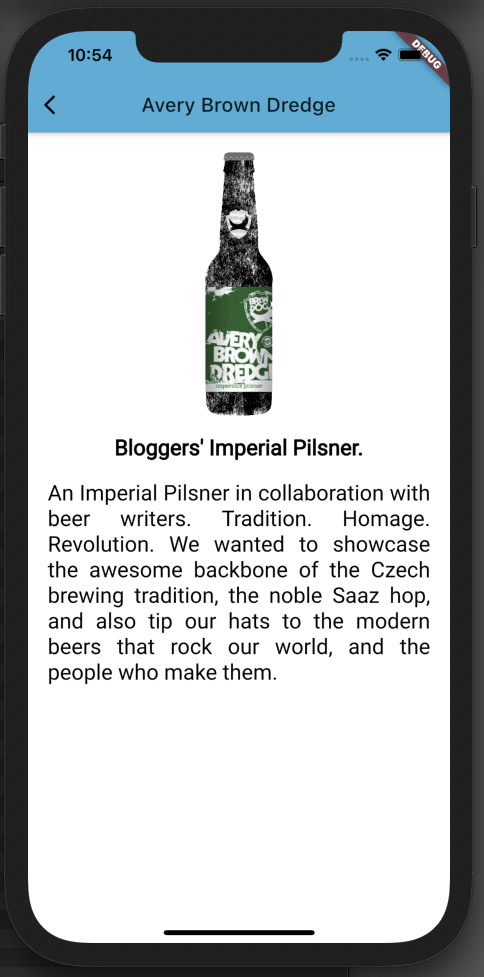
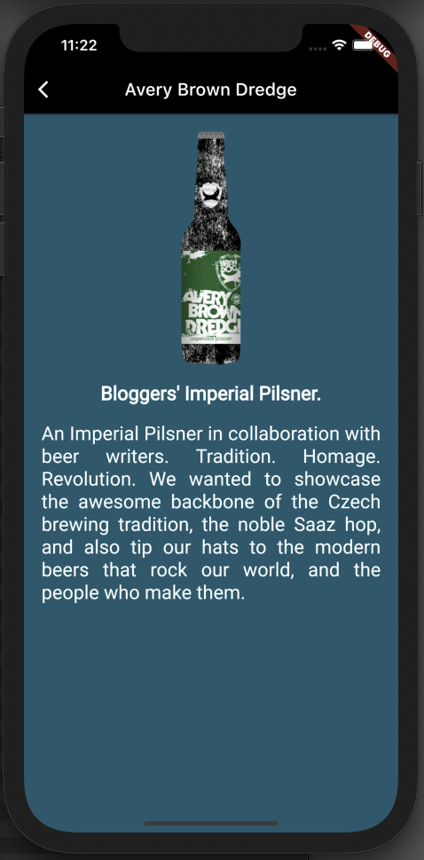

# 06- Detail Route

## Goal

The main goal of this step is to create the detail page with less guidance by examples

You are going to:

- use `AspectRatio` widget
- use `Hero` animation
- make your own choices to implement the detail page

At the end of this step, you will have built this :point_down:

<figure style="text-align: center;">
    
</figure>

## Criteria

<figure style="text-align: center;">
    
    
</figure>

- this page must implement the light and dark theme

- image

  - 16:10 aspect ratio

- tagline

  - fontSize: 22
  - bold
  - fontFamily: 'Roboto'

- description
  - fontSize: 20
  - fontFamily: 'Roboto'

## Hero animation

> You’ve probably seen hero animations many times. For example, a screen displays a list of thumbnails representing items
> for sale. Selecting an item flies it to a new screen, containing more details and a “Buy” button. Flying an image from
> one screen to another is called a hero animation in Flutter, though the same motion is sometimes referred to as a shared element transition.

Flutter provides an `Hero` widget to create easily a Hero animation between 2 routes. You have to define the `Hero` widget as
parent of the `Image` widget on both routes. The same tag have to be used to realize the hero animation.

[Learn more](https://flutter.dev/docs/development/ui/animations/hero-animations)

- in `PunkApiCard` and in `DetailRoute` widgets, add an `Hero` widget as parent of the beer's image

```dart
Hero(
    tag: '<TAG>',
    child: Image.network(
      beer.imageURL,
),
```
